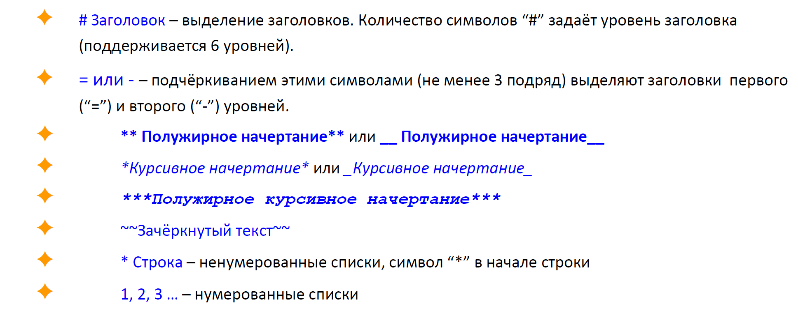

# Мое руководтсво по Git
## 1 Семминар
**Команды по Git. Освновные.**

1. **_git version_** - команда, позволяющая проверить версию github, установленную на компьютере.
2. **_git config_** - команда, позволяющая указать необходимую информацию о пользователе, будет доступна другим пользователям. 

    **Примеры использования:**

    * _git config --global user.name "Anna"_
    * _git config --global user.email "argo99@mail.ru"_
3. **_git status_** - команда, позволяющая проверить создан ли файл.
4. **_git init_** - команда, инициализирующая наш репозиторий.
5. **_git add_** - команда, добавляет файл или файлы к следующему коммиту. 

    **Пример использования:**

    * _git add .\GitEducation.md - название файла выбирается через Tab_
6. **_git commit_** - команда, создающая коммит.

    **Пример использования:**

    * _git commit -m "Название коммита"_
7. **_git log_** - команда, позволяющая посмотреть историю коммитов
8. **_git checkout_** - команда, позволяющая переходить от одного коммита к другому.

    **Пример использования:**

    * _git checkout 4541_
9. **_git checkout master_** - команда, позволяет перейти к самому последнему коммиту.
10. **_git diff_** - позволяет увидеть разницу между текущим файлом и закоммиченным файлом.

**Сиктансис языка Markdown. Краткая помятка основных инструментов выделения**

_Более подробную информацию можно увидеть по ссылке [Справочник по Markdown по Microsoft] (https://docs.microsoft.com/ru-ru/contribute/markdown-reference)._

## 2 Семинар
**Команды по Git. Работа с ветками.**
1. **_git branch_** - команда, позволяющая вывести список всех имеющихся веток на экран.
2. **_git branch branch_name_** - команда, позволяющая создать новую ветку. 
3. **_git checkout branch_name_** - команда, позволяющая перейти на новую ветку.
4. **_git merge branch_name_** - команда, позволяющая слить ветки.

     **Пример использования:**

    * _git merge lists_ - в текущую ветку добавить информацию из ветки lists

    _Примечание: если в разных ветках одна и та же строка написана по-разному, то при merge возникнет конфликт._
5. **_git branch -d branch_name_** - команда, позволяющая удалить слитую ветку. 
5. **_git lod - - graph_** - команда, позволяющая увидеть лог коммитов с визуализацией между ними.

## Семинар 3